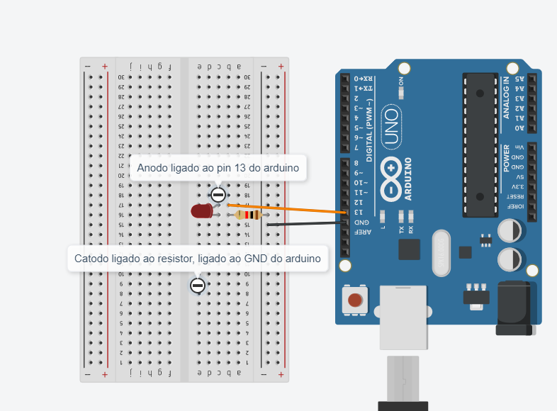

## Blink
Ligando e desligando Led, com intervalo de 1 segundos.

## Screenshots


```c
int LED = 13;

void setup()
{
  pinMode(LED, OUTPUT);
}

void loop()
{
  digitalWrite(LED, HIGH);
  delay(1000); 
  digitalWrite(LED, LOW);
  delay(1000); 
}
```
 
