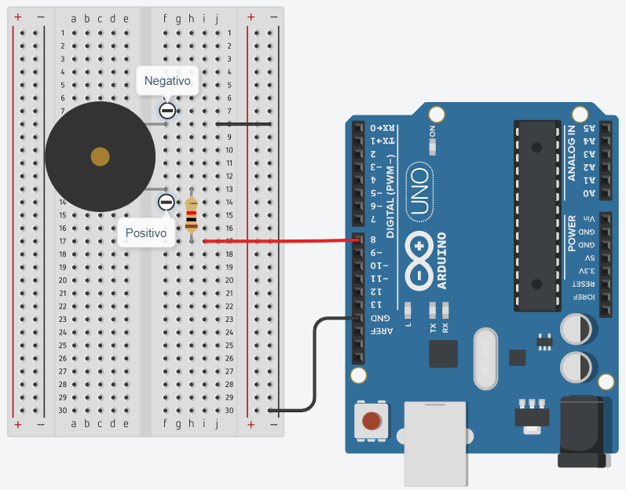

## Buzzer
O objetivo deste projeto é acionar um buzzer
utilizando as funções tone() e noTone(). Buzzer é um
dispositivo para geração de sinais sonoros (beeps), como
aqueles encontrados em computadores

## Screenshots


```c
int buzzer = 8;
int numNotas = 10;

// Vetor contendo a frequência de cada nota
int notas[] = {261, 277, 294, 311, 330, 349,
370, 392, 415, 440};

// Notas: C, C#, D, D#, E, F, F#, G, G#, A
/*
C=Dó D=Ré E=Mi F=Fá G=Sol A=Lá B=Si
As notas sem o “#”, são as notas naturais
(fundamentais).
Aquelas com o “#”, são chamadas “notas
sustenidas” (por exemplo: C#=Dó Sustenido).
*/ 

void setup()
{
  pinMode(buzzer, OUTPUT);
}

void loop()
{
  for (int i = 0; i < numNotas; i++) {
 	  tone(buzzer, notas[i]);
 	  delay(500);
 	}
 	noTone(buzzer);
  delay(1000);
}
```
 
