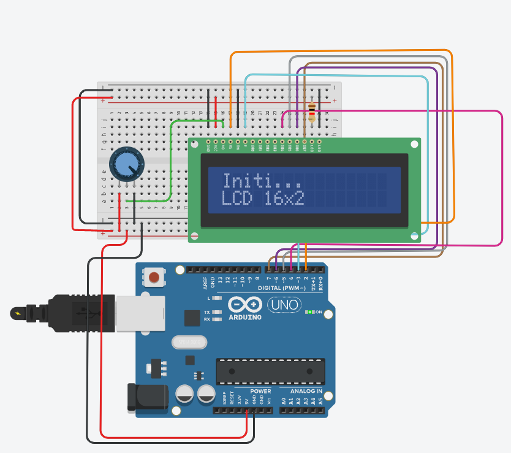

## Blink
Display LCD

## Screenshots


```c
#include <LiquidCrystal.h>

LiquidCrystal lcd(2,3,4,5,6,7);

void setup()
{
  lcd.begin(16, 2);
  lcd.setCursor(0,0);
  lcd.print("Initi...");
}

void loop()
{
	lcd.setCursor(0,1);
  	lcd.print(" LCD 16x2");
  	delay(1000);
  
}
```
 
