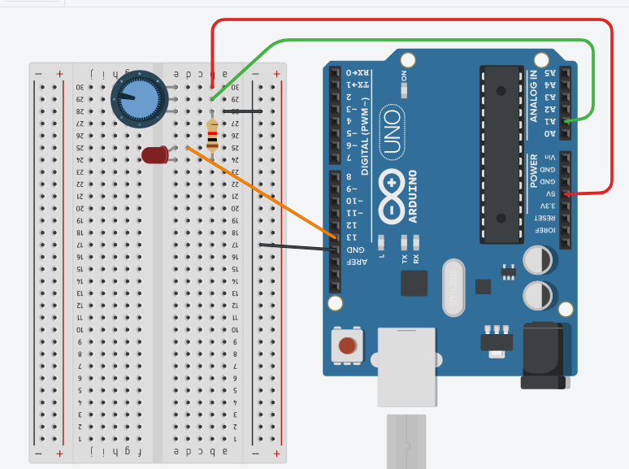

## Potenciômetro
O objetivo deste projeto é controlar a frequência de
acender e apagar (frequência de pisca-pisca) e a
intensidade da luminosidade de um LED.

Quando girar o "Potenciômetro" o "led" pisca de acordo com o giro.

## Screenshots


```c
int POT = A1;
int LED = 13;

//Valor obitido pelo potenciometro
int valor = 0;


void setup()
{
  pinMode(LED, OUTPUT);
}

void loop()
{
  valor = analogRead(POT);
  digitalWrite(LED, HIGH);
  delay(valor);

  digitalWrite(LED_BUILTIN, LOW);
  delay(valor);
}
```
 
