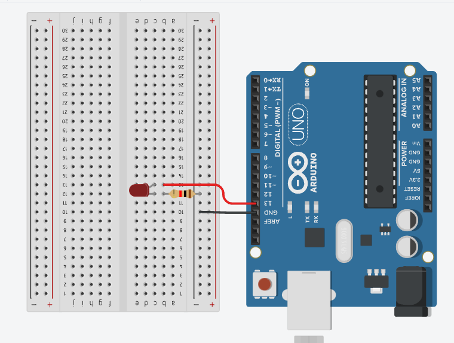

## Serial Port
O objetivo deste projeto é ligar/desligar um led utiliando API nodeJS

## Screenshots


## Bibliotecas utilizadas

- [Express](https://expressjs.com/pt-br/) 
- [Serial Port](https://serialport.io/docs/guide-usage/)

```c

#define led 13
int valor_lido;

void setup() {
  Serial.begin(9600);
  pinMode(led, OUTPUT);
}

void loop() {

  //informar se existe dados para ser exibido
  if(Serial.available() > 0){
    valor_lido = Serial.read();
  }

  if(valor_lido == 1){
    digitalWrite(led, HIGH);
  } else {
    digitalWrite(led, LOW);
  }
  
  Serial.println((String)"valor: "+valor_lido);
  delay(1000);
}
```
 
```nodejs
const express = require('express');
const http = require('http');

const app = express();
app.use(express.json());

const server = http.createServer(app);

const SerialPort = require('serialport');
const ReadLine = SerialPort.parsers.Readline;

const mySerial = new SerialPort("COM21", { 
  baudRate: 9600,
});

let myValue;
const parser = new ReadLine({ delimiter: '\r\n' });
mySerial.pipe(parser);

mySerial.on("open", () => {
  parser.on('data', (data) => {
    if(myValue !== undefined){
      if(myValue === 1){
        mySerial.write('1') 
      } else {
        mySerial.write('2') 
      }
    }
    
    console.log('data', data);
  });
});

app.post('/low', (request, response, next ) => {
  const { value } = request.body;
  myValue = value;
  return response.json({ message: value === 1 ? 'HIGH': 'LOW' })
});

server.listen(3000, () => {
  console.log('server run...');
});

```