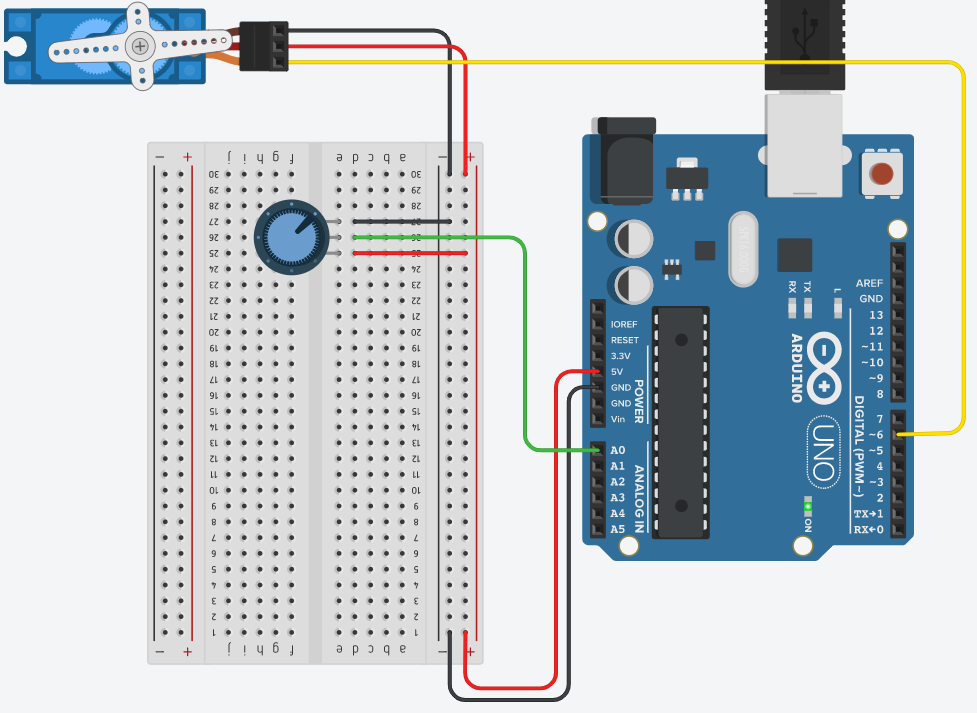

## Servo Motor
O objetivo destes projetos é mostrar o uso da
biblioteca “Servo.h” (já existente na IDE Arduino) para a
manipulação de servo motores

## Screenshots


```c
#include <Servo.h>

Servo servo;
int pino_pot = A0;
int pin_servo = 6;
int valor_pot; 
int angulo_servo;

void setup()
{
  servo.attach(pin_servo);
}

void loop()
{
	valor_pot = analogRead(pino_pot);           
  	angulo_servo = map(valor_pot, 0, 1023, 0, 180);
  	servo.write(angulo_servo);
  	delay(15); 
 
}
```
 
