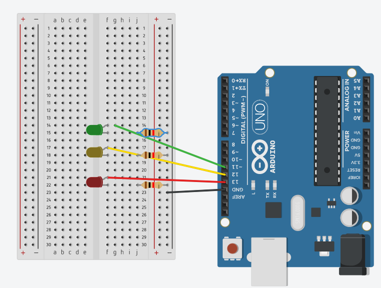

## Semáforo
Reproduzir um cenário similar ao de um semáforo de veículos.

## Screenshots



```c
int RED_LED = 13;
int YELLOW_LED = 12;
int GREEN_LED = 11;

void setup()
{
  pinMode(RED_LED, OUTPUT);
  pinMode(YELLOW_LED, OUTPUT);
  pinMode(GREEN_LED, OUTPUT);

}

void loop()
{
  digitalWrite(RED_LED, HIGH);
  delay(1000);
  
  digitalWrite(RED_LED, LOW);
  delay(1000); 
  
  digitalWrite(YELLOW_LED, HIGH);
  delay(1000);
  
  digitalWrite(YELLOW_LED, LOW);
  delay(1000); 
  
  digitalWrite(GREEN_LED, HIGH);
  delay(1000);
  
  digitalWrite(GREEN_LED, LOW);
  delay(1000); 
  
}
```
 
